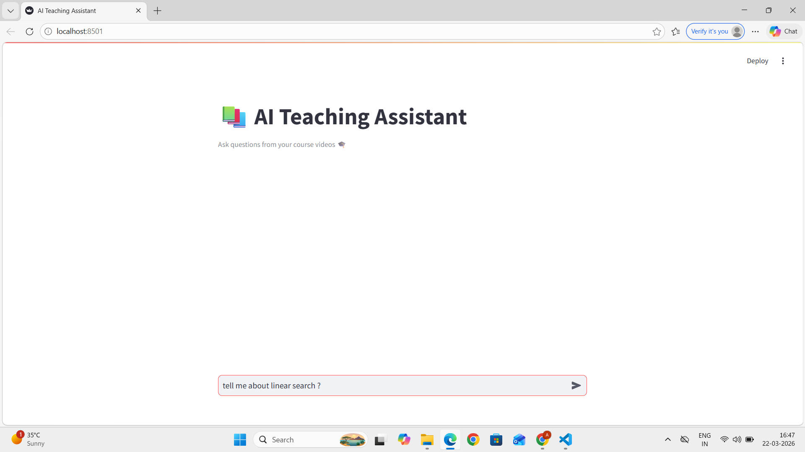
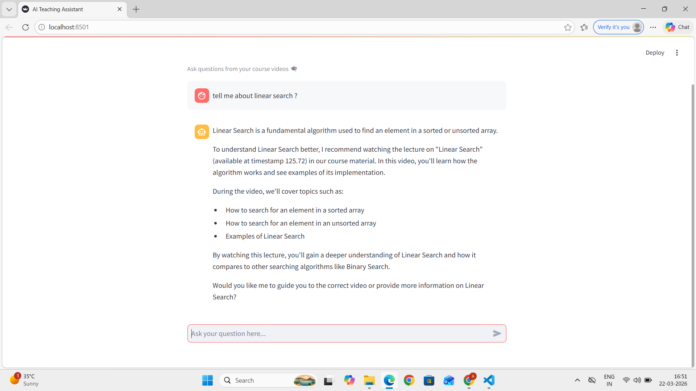

# 📚 RAG-Based AI Teaching Assistant for Video Lectures

An end-to-end Retrieval-Augmented Generation (RAG) system that converts lecture videos into a smart AI tutor.<br>
Users can ask questions and get context-aware answers with references to exact video content.

---
## 🚀 Features

- 🎥 Converts lecture videos into structured knowledge
- 🎧 Extracts audio and transcribes using Whisper
- 🌍 Supports multilingual transcription & translation
- 🧠 Generates semantic embeddings using bge-m3
- 🔍 Performs similarity-based retrieval using cosine similarity
- 🤖 Uses LLM (LLaMA via Ollama) for grounded responses
- 💬 Interactive chat-based UI using Streamlit
- 📌 Answers are based strictly on course content (no hallucination outside scope)

--- 
## 🧠 System Architecture


```
Videos → Audio → Transcription → Chunking → Embeddings → Storage
                                                    ↓
User Query → Embedding → Similarity Search → Context Retrieval → LLM → Answer
```
---

## 🛠️ Tech Stack


```
| Category         | Tools                  |
| ---------------- | ---------------------- |
| Language         | Python                 |
| Speech-to-Text   | Whisper                |
| LLM              | LLaMA 3.2 (via Ollama) |
| Embeddings       | bge-m3                 |
| Vector Search    | Cosine Similarity      |
| Data Handling    | Pandas, NumPy          |
| Storage          | Joblib                 |
| UI               | Streamlit              |
| Media Processing | FFmpeg                 |
```
---

## 📂 Project Structure


```
├── videos/               # Input lecture videos
├── audios/               # Extracted audio files
├── jsons/                # Transcribed and structured text
├── embeddings.joblib     # Stored embeddings
│
├── video_to_mp3.py       # Convert videos → audio
├── mp3_to_json.py        # Convert audio → transcription JSON
├── preprocess_json.py    # Generate embeddings
├── process_incoming.py   # Query + retrieval + LLM response
├── app.py                # Streamlit UI
│
└── README.md
```
---

## ⚙️ Installation & Setup

### 1️⃣ Clone the repository
```
git clone https://github.com/your-username/ai-teaching-assistant.git
cd ai-teaching-assistant
```

### 2️⃣ Install dependencies
```
pip install -r requirements.txt
```
### 3️⃣ Install FFmpeg

Make sure FFmpeg is installed and added to PATH.

### 4️⃣ Setup Ollama (for LLM + embeddings)

Install Ollama and run:
```
ollama run llama3.2
ollama pull bge-m3
```
Make sure Ollama is running:
```
http://localhost:11434
```
---

## 🔄 Data Processing Pipeline

### Step 1: Add videos
Place all lecture videos inside:
```
videos/
```

### Step 2: Convert video → audio
```
python video_to_mp3.py
```

### Step 3: Convert audio → JSON (transcription)
```
python mp3_to_json.py
```

### Step 4: Generate embeddings
```
python preprocess_json.py
```

This creates:
```
embeddings.joblib
```
---

## 💬 Run the Application
```
streamlit run app.py
```
Open in browser:
```
http://localhost:8501
```
---

## 🧪 How It Works

1.User enters a query<br>
2.Query is converted into embedding<br>
3.System finds most relevant lecture chunks<br>
4.Retrieved context is passed to LLM<br>

---

## 🖼️ Screenshots

Screenshots are stored in the `screenshots/` directory.








---


## 🎯 Key Highlights

- ✅ End-to-end RAG implementation (not a toy example)
- ✅ Multimodal pipeline (video → audio → text → embeddings)
- ✅ Local LLM + embeddings (privacy-friendly)
- ✅ Domain-restricted answering (course-specific)
- ✅ Interactive UI for real-time usage
---

## 🔥 Future Improvements
- 🎥 Video player with timestamp navigation
- ⚡ Faster retrieval using FAISS
- 🌐 Deployment on cloud (Streamlit Cloud / AWS)
- 🧠 Conversational memory (multi-turn chat)
- 📊 Evaluation metrics for retrieval quality
---
## 👩‍💻 Author

Akanksha Agre<br>
Final Year Engineering Student | AI/ML Enthusiast

